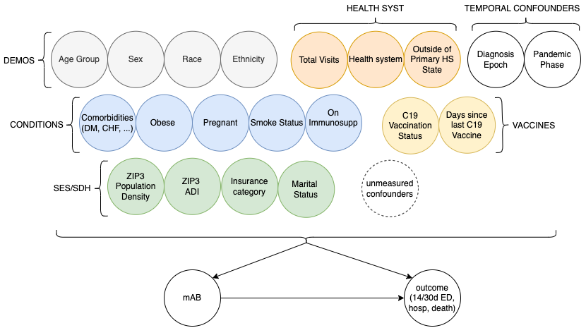

# 2. Propensity Score Model (PS)

The scripts here are used fit candidate propensity models

- The propensity score model approximates a patients probability of treatment given their confounders
- Confounders were selected with input from clinical and statistical experts and can be seen in the diagram below
- Early in the analysis, a robust grid search was performed to find optimal hyperparameters for each class of modeling algorithms. In this repository, the parameter grid is constrained to the best performing configurations from that grid search 
- In treatment effect analyses, the propensity score is not a predictive model and will never be expected to perform on out of sample data. It is trained to control confounding between treated and untreated patients in the particular sample of analysis and should be retrained with use in a difference sample. As such, traditional ML evaluation metrics are not relevant for propensity model evaluation in this use case. Instead, covariate balance assessment is used for model selection. See `3_ps-covariate-balance/README.md` for more information.

## Code requirements and process
`main_ps.py` expects inputs matching the schemas of `1_imputation/data/mab_patient_effect_imputed.csv` and `2_ps/data/configs.csv`, respectively. The configs file specifies which confounders should be included in the propensity score modeling and their corresponding data types. The main script filters the imputed dataset input to just the relevant covariates from configs, and performs preprocessing prior to model fitting, including one-hot encoding and standardization. The main script then fits all candidate logistic regression, random forest, and gradient-boosted tree models. The dataframe of the imputed data filtered to only the relevant covariates is written out to `2_ps/data/get_dataframe.csv` as intermediate output for use in downstream covariate balance assessment. The final dataframe containing the propensity scores for each person_id, impute_id combination for all candidate models is saved in `2_ps/data/merge_models.csv`.