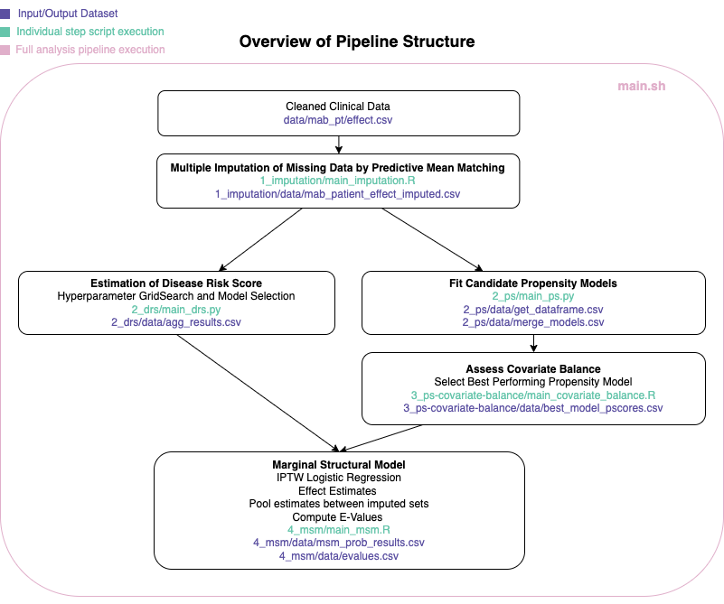

# Monoclonal Antibodies RWE

This analytic pipeline was developed as part of the Real World Evidence to Accelerate COVID-19 Therapeutics project. The Department of Health and Human Services’ (HHS) Office of the Assistant Secretary for Preparedness and Response (ASPR) contracted with the HHS’s Health Federally Funded Research and Development Center (Health FFRDC) to conduct a real-world observational study of the safety and effectiveness of Monoclonal Antibodies (mAbs) to fight SARS-CoV-2.

This pipeline was originally developed in the proprietary environment [Syntropy](https://www.syntropy.com/about-us/) and uses open-source programming languages (R and Python). The toy dataset included in this repository is provided for example purposes only and does not contain any actual health system data. The dataset was derived from a data model very similar to the [OMOP Common Data Model](https://ohdsi.github.io/CommonDataModel/). A data dictionary is provided in the [data/mab_pt_effect_variables.xlsx](data/mab_pt_effect_variables.xlsx) file and as a [README within the data folder](data/README.md). 

Clinical data were prepared for modeling and analysis by cleaning, harmonization, and imputation of missing clinical data. The disease risk score (DRS) was estimated. For each imputed data set the propensity score (PS) was estimated. The covariate balance was assessed on the treated and non-treated inverse propensity score weighted (also referred to as inverse probability treatment weighted or IPTW) data. Marginal structural models (MSM) were used to control for confounding and estimate treatment effects. Sensitivity analysis using the E score was performed to determine the strength that an unmeasured confounder must have to nullify the statistical significance of estimated effects. Further information and justification of each step in the pipeline can be found in the README of the relevant sub-directory.


<div style="text-align:center"></div>

## Requirements

To run or update the the modeling pipeline, the following pieces of computer software are required:

- A computer with any operating system (Windows, Linux, or MacOS)
- [R](https://www.r-project.org/)
- [Python 3.7+](https://docs.conda.io/en/latest/miniconda.html)

As this pipeline was originally developed in the proprietary environment [Syntropy](https://www.syntropy.com/about-us/), the pipeline was designed to run on a specific set of R and Python package versions that were contained in the Syntropy environment. In particular, the version of the Python package Pandas that was available in this environment at the time of analysis was 0.25.3. Pandas 0.25.3 has known security vulnerabilities, so the code in this open source repository has been adapted to be compatible with an updated version (Pandas 1.0.4), where the vulnerability has been patched. **To ensure the pipeline runs on your environment, verify that the Python package versions exactly match those in the [requirements.txt](requirements.txt) file; failing to do so may result in runtime errors.** 

*NOTE: While every effort was made to ensure the security of the open source packages used in this pipeline, users are responsible for ensuring that the software and packages they install are compliant with their organization's security policies.*

## Installation

Begin by cloning this repository which will download all required scripts needed to set up your local back-end database and run the application locally.

```shell
git clone git@github.com:mitre/covid19-mabs-rwe.git
```

Next, ensure the following Python packages are installed either using `pip` or `conda`.

```shell
pip install -r requirements.txt
```

or...

```shell
conda install --file requirements.txt
```

Finally, open and run `setup.R` in your R environment. This script checks your local R packages, determines which, if any, new packages need to be installed, and then installs them from your default CRAN mirror. 

## Usage

This pipeline was originally developed in Syntropy, but has been modified to run outside that platform. Given that it was developed in that environment, the code may be formatted or structured differently than in other typical analysis code pipelines. While this code was developed with generalizability in mind, users should be aware that this pipeline is an analysis that was instantiated on a particular data sample for a particular problem. Although the pipeline code may run on any dataset that matches the schema of [mab_pt_effect.csv](data/mab_pt_effect.csv), the intended use of this repository is for guidance in performing similar analyses. Use of this code for future analyses should not be done without careful review of the modeling methods and decisions that were made for the Real World Evidence to Accelerate COVID-19 Therapeutics project specific use case. The original study used data from multiple health systems. If you intend to use this pipeline for a single health system, preprocessing and standardization logic that pertains to use of multiple health systems will need to be modified or removed.

### Data Requirements
This repository contains a toy dataset ( [mab_pt_effect.csv](data/mab_pt_effect.csv) ) that may be used to run and test the pipeline. This dataset was synthetically generated based on the actual study data, and therefore may contain logical inconsistencies; it has, however, been scrubbed of any potentially identifying information including geographic indicators. While this dataset may be used to run the pipeline, the results are not meaningful and should not be used in any way to derive conclusions about the effectiveness of mAbs. Please also note that because data was synthetically generated for this repository, running the pipeline with the toy dataset ( [mab_pt_effect.csv](data/mab_pt_effect.csv) ) may produce warning messages in the log output.

To run this pipeline on an institution's data, replace the toy dataset with a similarly structured csv file. Ensure the columns and datatypes align with those included in the toy dataset.

*NOTE: It is the responsibility of the user to [de-identify the dataset](https://www.hhs.gov/hipaa/for-professionals/privacy/special-topics/de-identification/index.html) prior to using this analysis pipeline, and to obtain appropriate* *Institutional Review Board (IRB) approval if required. It is recommended to hash the person_id column to limit potential privacy concerns.*

### Running the Pipeline
To execute the full pipeline, replace the [mab_pt_effect.csv](data/mab_pt_effect.csv) data file with the dataset you desire to analyze and run the main.sh driver script from the root directory of the repository. 

```shell
bash main.sh
``` 

This script will walk through the pipeline step-by-step (this may take a large amount of time depending on the size of the dataset).

To execute individual phases of the script, run the relevant sub-directory [main](main.sh) script file. Each main script must also be run from the root directory of the repository. For example, to run just the imputation step:

```shell
python 2_ps/main_ps.py
``` 

## License

Copyright 2022, The MITRE Corporation

Approved for Public Release; Distribution Unlimited. Public Release Case Number 22-1741.

Licensed under the Apache License, Version 2.0 (the "License");
you may not use this file except in compliance with the License.
You may obtain a copy of the License at

    http://www.apache.org/licenses/LICENSE-2.0

Unless required by applicable law or agreed to in writing, software
distributed under the License is distributed on an "AS IS" BASIS,
WITHOUT WARRANTIES OR CONDITIONS OF ANY KIND, either express or implied.
See the License for the specific language governing permissions and
limitations under the License.

## NOTICE

This software and data was produced for the U. S. Government under Contract Number 75FCMC18D0047, and is subject to Federal Acquisition Regulation Clause 52.227-14, Rights in Data-General.

No other use other than that granted to the U. S. Government, or to those acting on behalf of the U. S. Government under that Clause is authorized without the express written permission of The MITRE Corporation.

For further information, please contact The MITRE Corporation, Contracts Management Office, 7515 Colshire Drive, McLean, VA 22102-7539, (703) 983-6000.

Copyright 2022 The MITRE Corporation.
